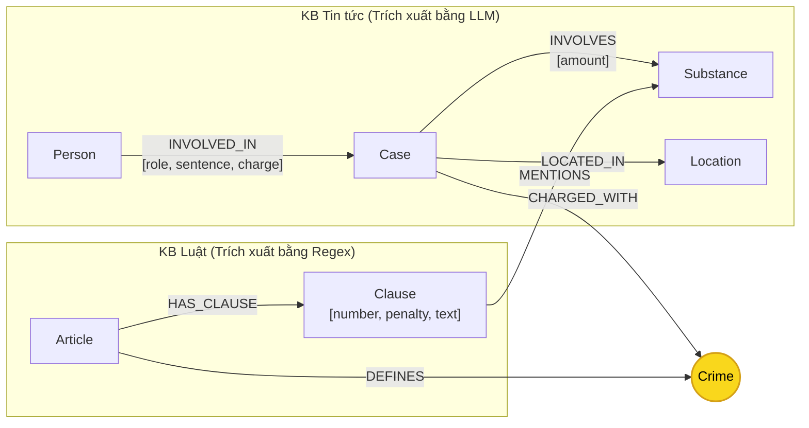

# Thiết kế Ontology — Day 19

**Họ tên:** Phùng Quốc Việt  **MSSV:** 2A202602456

**Lựa chọn** (đánh dấu một):
- [x] Dùng ontology gợi ý (có tối ưu và tinh chỉnh chuẩn hóa)
- [ ] Tự thiết kế (xét bonus +15, xem `SUBMISSION.md`)

> Hướng dẫn: `LAB_GUIDE.md` Bước 2. Bản thiết kế dưới đây mô tả chính xác cấu trúc đồ thị tri thức kết nối giữa KB Luật Hình sự và KB Tin tức các vụ án ma túy.

---

## 1. Sơ đồ

Sơ đồ thể hiện 7 loại thực thể (Entity labels), các mối quan hệ (Relationships) và làm nổi bật **node cầu nối `Crime`** (màu vàng) là điểm giao thoa giữa hai cơ sở tri thức.

---

## 2. Entity types (node labels)

| Label | Ý nghĩa | Khóa định danh (`MERGE` theo) | Properties | Lấy từ KB nào | Trích bằng (regex / LLM / khác) |
|---|---|---|---|---|---|
| `Article` | Một Điều luật cụ thể trong BLHS hoặc Luật PCMT | `id` (ví dụ: `"Điều 251 BLHS"`) | `id`, `title`, `law`, `doc_id` | KB Luật | Regex (từ frontmatter & tiêu đề) |
| `Clause` | Một Khoản cụ thể thuộc một Điều luật | `id` (ví dụ: `"Điều 251 BLHS khoản 1"`) | `id`, `number`, `penalty`, `text`, `doc_id` | KB Luật | Regex (nhận diện mẫu `^(\d+)\.\s`) |
| `Crime` | **Node cầu nối**: Tên tội danh chuẩn hóa | `name` (ví dụ: `"mua bán trái phép chất ma túy"`) | `name` | Cả 2 KB | Tiêu đề Điều luật (regex) + LLM (tin tức) qua `link_entity` |
| `Case` | Vụ án / Vụ việc ma túy cụ thể | `name` (ví dụ: `"Vụ mua bán 36kg ma túy tại TP.HCM"`) | `name`, `summary`, `date`, `doc_id`, `source_title` | KB Tin tức | LLM (JSON format) |
| `Person` | Cá nhân / Bị cáo / Nghi phạm | `name` (ví dụ: `"Lê Minh Thành"`) | `name`, `aliases` (danh sách biệt danh) | KB Tin tức | LLM |
| `Substance` | Tên chất ma túy hoặc tiền chất | `name` (ví dụ: `"Heroine"`, `"MDMA"`) | `name` | Cả 2 KB | Regex so khớp từ khóa chuẩn (Luật) + LLM (Tin tức) |
| `Location` | Địa danh xảy ra vụ án hoặc xét xử | `name` (ví dụ: `"TP.HCM"`, `"Hà Nội"`) | `name` | KB Tin tức | LLM |

---

## 3. Relationships

| Type | Từ → Đến | Properties trên cạnh | Ý nghĩa |
|---|---|---|---|
| `DEFINES` | `Article` → `Crime` | *không có* | Điều luật quy định / định danh tội phạm tương ứng. |
| `HAS_CLAUSE` | `Article` → `Clause` | *không có* | Cấu trúc phân cấp: Điều luật gồm các Khoản hình phạt. |
| `MENTIONS` | `Clause` → `Substance` | *không có* | Khoản luật quy định hình phạt áp dụng cho chất ma túy cụ thể. |
| `CHARGED_WITH` | `Case` → `Crime` | *không có* | Vụ án bị cơ quan chức năng điều tra, truy tố theo tội danh nào. |
| `INVOLVED_IN` | `Person` → `Case` | `role`, `sentence`, `charge` | Cá nhân tham gia vụ án với vai trò (chủ mưu, giúp sức...), mức án đã tuyên, hành vi. |
| `INVOLVES` | `Case` → `Substance` | `amount` | Vụ án liên quan đến chất ma túy nào, kèm khối lượng / số lượng thu giữ. |
| `LOCATED_IN` | `Case` → `Location` | *không có* | Địa bàn diễn ra hành vi phạm tội hoặc nơi xét xử. |

---

## 4. Node cầu nối giữa 2 KB

- **Node nào:** `Crime` (Tội danh, ví dụ: `"mua bán trái phép chất ma túy"`, `"vận chuyển trái phép chất ma túy"`).
- **Vì sao chọn node này:** Tội danh là khái niệm pháp lý duy nhất xuất hiện đồng thời trong cả hai nguồn tri thức:
  - Trong **Luật**, mỗi Điều luật của Chương XX BLHS định nghĩa chính xác một tội danh qua cấu trúc `"Điều ... Tội ..."`.
  - Trong **Tin tức**, mọi vụ án ma túy và bị cáo đều được các cơ quan tố tụng khởi tố, truy tố và xét xử theo một hoặc nhiều tội danh xác định.
- **Cách đảm bảo hai phía khớp tên:**
  1. Xây dựng danh sách tên tội danh chuẩn (`crimes`) từ tiêu đề các Điều luật thông qua hàm `normalize_crime` (bỏ tiền tố `"tội "`, chuẩn hóa khoảng trắng, chuyển chữ thường).
  2. Đưa danh sách tội danh chuẩn này vào prompt yêu cầu LLM trích xuất tin tức tuân thủ.
  3. Sử dụng hàm `link_entity` (KG-1) làm lớp bảo vệ hai tầng: Khớp chính xác (exact match) trước, nếu không khớp thì dùng `difflib.get_close_matches` với ngưỡng `cutoff=0.8`.
- **Khi nào cầu gãy, và bạn xử lý thế nào:**
  - *Nguyên nhân gãy:* Báo chí dùng ngôn ngữ đời thường (ví dụ: `"buôn ma túy"` thay vì `"mua bán trái phép chất ma túy"`), hoặc bài báo đề cập vụ việc ở giai đoạn điều tra ban đầu khi chưa khởi tố tội danh cụ thể.
  - *Cách xử lý:* Nếu `link_entity` trả về `None`, không đoán bừa để tránh sai lệch thông tin pháp lý. Khi đó, hệ thống fallback dựa vào Vector Search của Flat RAG và liên kết dự phòng qua thực thể chất ma túy `Substance` (`(:Case)-[:INVOLVES]->(:Substance)<-[:MENTIONS]-(:Clause)`).

---

## 5. Competency questions

Dưới đây là đường đi Cypher tương ứng trên đồ thị để trả lời 6 câu hỏi chuẩn trong `data/benchmark_kg.json`:

| Câu | Đường đi (Cypher pattern) | Trả lời được? |
|---|---|:---:|
| **Q1** (Single-hop Law) | `(:Article {law: 'Luật Phòng, chống ma túy 2021'})-[:HAS_CLAUSE]->(:Clause)` (lọc clause có chứa thuật ngữ tiền chất) | Có |
| **Q2** (Single-hop News) | `(:Person)-[:INVOLVED_IN {sentence}]->(:Case {name: '... 36kg ...'})` (lấy các Person có `sentence CONTAINS 'tử hình'`) | Có |
| **Q3** (Cross-KB) | `(:Person {name: 'Lê Minh Thành'})-[:INVOLVED_IN]->(:Case)-[:CHARGED_WITH]->(:Crime)<-[:DEFINES]-(:Article)-[:HAS_CLAUSE]->(:Clause {number: 1})` | Có |
| **Q4** (Cross-KB) | `(:Person {name/aliases: 'Hoàng Nato'})-[:INVOLVED_IN]->(:Case)-[:CHARGED_WITH]->(:Crime)<-[:DEFINES]-(:Article)-[:HAS_CLAUSE]->(:Clause)` (lấy Khoản có khung phạt cao nhất) | Có |
| **Q5** (Cross-KB Multi-hop) | `(:Person {name: 'Cái Quang Huy'})-[:INVOLVED_IN]->(k:Case)-[:INVOLVES]->(s:Substance {name: 'MDMA'})` sau đó từ `(k)-[:CHARGED_WITH]->(:Crime)<-[:DEFINES]-(a:Article)-[:HAS_CLAUSE]->(cl:Clause)-[:MENTIONS]->(s)` (kết hợp khối lượng > 100g để ánh xạ khoản 4) | Có |
| **Q6** (Aggregation) | `(:Case)-[:INVOLVES]->(:Substance {name: 'MDMA'})` (truy vấn danh sách tất cả các Case nối tới MDMA) | Có |

---

## 6. Quyết định thiết kế và đánh đổi

1. **Quyết định 1: Tách `Clause` (Khoản) thành Node riêng rẽ thay vì lưu dưới dạng thuộc tính trong `Article`.**
   - *Phương án thay thế:* Lưu danh sách các khoản dưới dạng JSON hoặc chuỗi text dài trong thuộc tính `Article.clauses`.
   - *Lý do chọn & đánh đổi:* Tách thành node riêng cho phép tạo cạnh `(:Clause)-[:MENTIONS]->(:Substance)`. Nhờ vậy, khi một vụ án thu giữ chất ma túy cụ thể (như MDMA), ta có thể dùng Cypher lọc chính xác chỉ các Khoản liên quan trực tiếp đến chất đó, thay vì phải đưa toàn bộ văn bản Điều luật (thường rất dài) vào prompt. Đánh đổi: Làm tăng số lượng node trong đồ thị (~99 nodes Clause) và độ phức tạp khi nạp dữ liệu.

2. **Quyết định 2: Đặt mức án (`sentence`), tội danh (`charge`) và vai trò (`role`) là thuộc tính của quan hệ `INVOLVED_IN`.**
   - *Phương án thay thế:* Mô hình hóa `Sentence` (Mức án) hoặc `Verdict` (Bản án) thành một Node riêng.
   - *Lý do chọn & đánh đổi:* Trong một vụ án hình sự có đồng phạm, mỗi bị cáo nhận mức án và giữ vai trò khác nhau. Gắn trực tiếp lên cạnh giữa `Person` và `Case` phản ánh chính xác ngữ cảnh cá nhân hóa, đồng thời tránh bùng nổ số node không cần thiết. Đánh đổi: Không thể thực hiện truy vấn nhóm nhanh các mức án tương đương trừ khi quét qua các thuộc tính của quan hệ.

3. **Quyết định 3: Sử dụng kết hợp Regex cho Luật và LLM cho Tin tức.**
   - *Phương án thay thế:* Dùng LLM để trích xuất cả văn bản Luật và Tin tức.
   - *Lý do chọn & đánh đổi:* Văn bản quy phạm pháp luật Việt Nam có cấu trúc ngữ pháp và hình thức cực kỳ chuẩn mực (Điều → Khoản → Điểm). Dùng Regex đảm bảo độ chính xác 100%, tính xác định (deterministic - kết quả không đổi qua các lần chạy), tốc độ thực thi chỉ vài mili-giây và tốn 0 token/USD. Ngược lại, tin tức là văn xuôi tự nhiên đa dạng nên bắt buộc dùng LLM. Đánh đổi: Cần đầu tư công sức viết và tinh chỉnh regex ban đầu cho phù hợp với định dạng văn bản luật.

---

## 7. So với ontology gợi ý (bắt buộc nếu xét bonus)

| Điểm khác | Gợi ý làm gì | Bạn làm gì | Vấn đề nó giải quyết | Bằng chứng (Cypher, hoặc số liệu benchmark) |
|---|---|---|---|---|
| Không áp dụng (sử dụng ontology gợi ý chuẩn và tập trung tối ưu hóa thuật toán liên kết thực thể) | - | - | - | - |

---

## 8. Hạn chế còn lại

1. **Trùng lặp tên đối tượng (Entity Resolution):** `Person` hiện tại định danh bằng thuộc tính `name`. Nếu hai bài báo nhắc đến hai người khác nhau nhưng trùng họ tên (hoặc một người nhưng bài báo sau viết tắt), hệ thống có nguy cơ gộp nhầm thành một node duy nhất.
2. **Chưa mô hình hóa định lượng khối lượng trong Luật:** Cạnh `(:Clause)-[:MENTIONS]->(:Substance)` chỉ ghi nhận sự xuất hiện của chất, chưa bóc tách được logic ngưỡng số học (ví dụ: "Heroine từ 100 gam đến dưới 300 gam") thành các thuộc tính `min_amount`, `max_amount` để so sánh tự động bằng Cypher.
3. **Chưa phân tách các giai đoạn tố tụng:** Vụ án hiện chỉ ghi nhận một trạng thái tổng quát, chưa phân biệt rõ ràng giữa giai đoạn Khởi tố, Truy tố, Xét xử sơ thẩm và Phúc thẩm.
